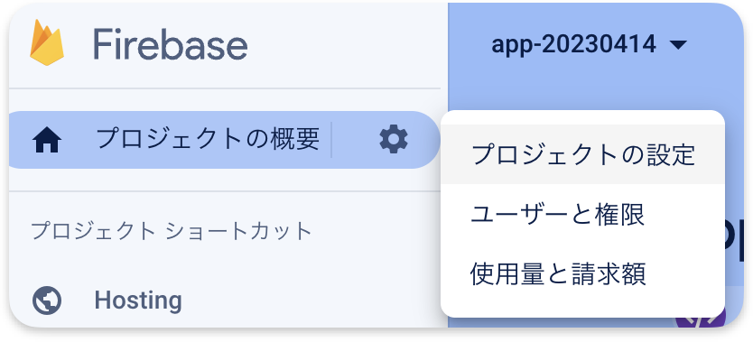
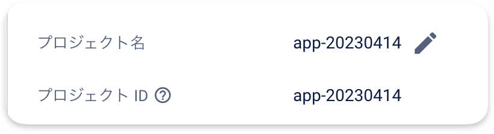

# クソアプリ


<p align="center">クソアプリハッカソンでつくるアプリ</p>

## Install

```bash
npm install
```

## Run

```bash
npm run dev
```

## Build

```bash
npm run build
```

## Deploy Setting

1. Firebase Token の取得
2. 出力された「1//xxx」を選択

```bash
firebase login:ci
```

- プロジェクト ID の取得

1. firebase コンソールにアクセス
2. 左上の「プロジェクトの設定」をクリック



1. プロジェクト ID を選択



以下の 2 つを GitHub Actions Secrets に登録

- Firebase Token
- プロジェクト ID

本アプリで使用するデータにおける名称や商標は株式会社カプコンに帰属します。
本アプリは、株式会社カプコンの商標および著作物を使用するにあたり以下のガイドラインを遵守しております。

[配信者ガイドライン](https://www.capcom-games.com/ja-jp/video-policy/)
